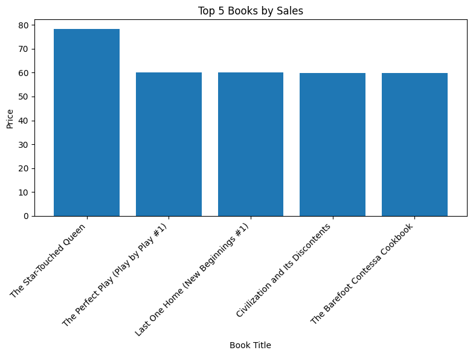
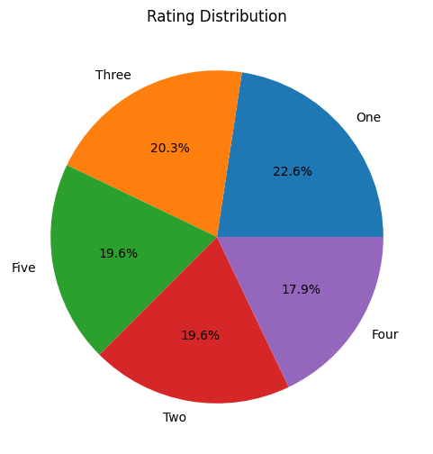

# Bookshop-Web-Scraping

## Table of Contents
- [Project Overview](#project-overview)
- [Data Sources](#data-sources)
- [Tools](#tools)
- [Data Cleaning/Preparation](#data-cleaningpreparation)
- [Web Scraping](#web-scraping)
- [Exploratory Data Analysis](#exploratory-data-analysis)
- [Conclusion](#conclusion)

### Project Overview
---
This project aims to develop a Python script to scrape data from online bookshops.

### Data Sources
The data source for this project will be online bookshop websites.

### Tools
- Python - Web Scraping, Data Analysis, Data Processing, Data Preparation and Data Visualization

### Data Cleaning/Preparation

In the data preparation phase, we performed the following tasks:
1. Data loading and inspection
2. Data cleaning and formatting

```python
df.info()
df.describe()
df.isnull().sum()
```

### Web Scraping
For web scraping we used
- requests: Used to send HTTP requests to the website and retrieve content.
- BeautifulSoup: Used to parse the HTML content of the webpage and extract data.
- pandas (pd): Used for creating DataFrames to store our scraped data.

The code iterates through pages 1 to 50 of the website:
```python
books = []
for i in range (1, 51):
    url = f'https://books.toscrape.com/catalogue/page-{i}.html'
    response = requests.get(url)
    response = response.content
    soup = BeautifulSoup(response, 'html.parser')
    ol = soup.find('ol')
    articles = ol.find_all('article', class_ = 'product_pod')

    for article in articles:
        image = article.find('img')
        title = image.attrs['alt']
        star = article.find('p')
        star = star['class'][1]
        price = article.find('p', class_ = 'price_color').text
        price = float(price[1:])
        books.append([title, price, star])
```

To create a DataFrame to store our data, we used:
```python
df = pd.DataFrame(books, columns=['Title', 'Price', 'Star Rating'])
```

To store our data to our local machine we used:
```python
df.to_csv('books.csv', index=False)
```

### Exploratory Data Analysis
- We checked the data for null values
```python
df.isnull().sum()
```
Through this we were able to determine that we had no null values in our dataset
- To determine the total number of books in our data, we used:
```python
df['Title'].nunique()
```
The total number of books was discovered to be 999
- To determine the average price of books:
```python
average_price = df["Price"].mean()
average_price
```
Average price was discovered to be approximately 35 pounds

- We used he code below to determine the Top 5 Most expensive Books
```python
top_book_sales = pd.DataFrame(df.groupby('Title')['Price'].sum().sort_values(ascending = False).reset_index()).head(5)
```
We then created a simple chart for it;
```python
plt.figure(figsize=(8, 6))  # Adjust figure size as desired
plt.bar(top_book_sales['Title'], top_book_sales['Price'])
plt.xlabel('Book Title')
plt.ylabel('Price')
plt.title('Top 5 Books by Sales')
plt.xticks(rotation=45, ha='right')  # Rotate book titles for better readability

# Display the chart
plt.tight_layout()
plt.show()
```


- To determine rating distribution we used the code below:
```python
rating_dist = df['Star Rating'].value_counts(normalize=True)*100
```
For our visualization, we used;
```python
plt.figure(figsize=(6, 6))
plt.pie(rating_dist, labels=rating_dist.index, autopct="%1.1f%%")
plt.title("Rating Distribution")
plt.show()
```


### Conclusion
This project successfully scraped book data from the website "Books to Scrape".  The data was then analyzed to reveal insights about book prices, sales trends, and rating distribution.
